.. _ergonomie:

#########
Ergonomie
#########

Cette partie vise à présenter l'ergonomie du logiciel c'est-à-dire à décrire la
connexion à l'application, la structure de l'application, la navigation et
l'utilisation du menu, ainsi que la présentation et la description des
principaux icônes. Cette rubrique peut s'appliquer à toute application métier
développée avec OpenMairie.

*************************************
Connexion, déconnexion et permissions
*************************************

Connexion
#########

.. note::

   Pour réaliser cette étape, votre administrateur doit vous fournir une
   adresse Web pour accéder à l'application, un identifiant utilisateur ainsi
   qu'un mot de passe. Ces éléments auront été préalablement configuré dans
   le logiciel.

-----------------------
 
**Navigateur Web**

-----------------------

L'application est accessible via un navigateur Web, pour y accéder il faut
saisir l'adresse Web fournie par votre administrateur dans la barre d'adresse.

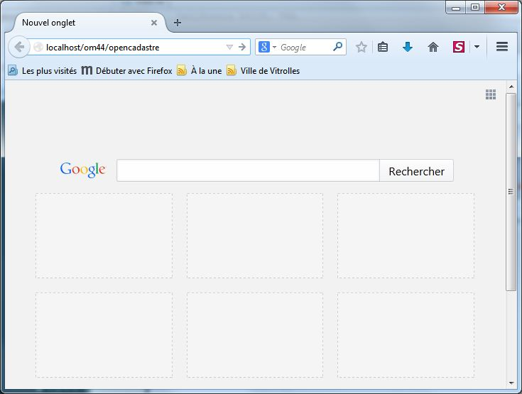

.. note::

    Ce logiciel est développé principalement sous le navigateur Mozilla Firefox,
    il est donc conseillé d'utiliser ce navigateur pour une efficacité optimale.

-----------------------

**Saisie des informations de connexion**

-----------------------

Cet écran de connexion est composé de deux zones de texte et d'un bouton.

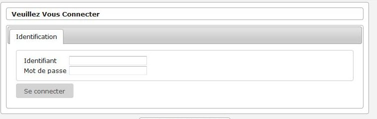

Dans l'écran d'identification, il faut saisir son identifiant et son mot de
passe puis cliquer sur le bouton « Se connecter ».

.. note::

    L'identifiant et le mot de passe doivent être saisis en respectant la
    casse, c'est-à-dire les minuscules et majuscules.

-----------------------

**Connexion échouée**

-----------------------

Si les identifiants saisis sont incorrects, un message d'erreur apparaît et il
faut ressaisir les informations de connexion.

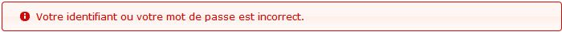

-----------------------

**Connexion réussie**

-----------------------

Si les identifiants sont corrects, vous êtes redirigé vers la page demandée sur
laquelle le message suivant doit d'afficher.

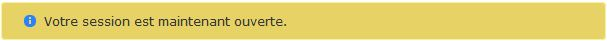

Déconnexion
###########

Pour une question de sécurité évidente, il est important de se déconnecter de
l'application pour qu'un autre utilisateur ne puisse pas accéder au logiciel
via votre compte utilisateur.

L'action "Déconnexion" est disponible à tout moment dans les actions
personnelles en haut à droite de l'écran.

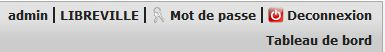

Une fois déconnecté, c'est le formulaire de donnexion qui s'affiche avec un
message expliquant la réussite de la déconnexion.

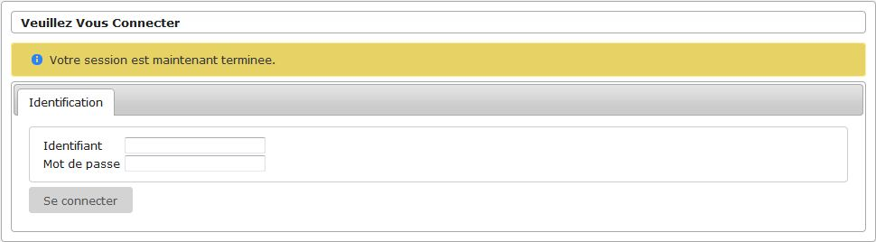

Les droits et profils des utilisateurs
######################################

Les droits et profils des utilisateurs permettent de limiter l'accès aux
informations et aux actions uniquement aux personnes autorisées. Chaque
utilisateur est associé à un profil. Le profil correspond à un ensemble
de permissions de l'utilisateur, par défaut il existe cinq profils :

#. Consultation,

#. Utilisateur limité,

#. Utilisateur,

#. Super utilisateur,

#. Administrateur.

Chaque page de l'application est associée à un profil. Pour chaque accès à une
page, l'application vérifie si l'utilisateur a un profil supérieur ou égal au
profil de la page consultée, si c'est le cas l'utilisateur à donc le droit
d'accéder aux informations.

******************
Ergonomie générale
******************

L'application, sur la grande majorité des écrans, conserve ses composants
disposés exactement au même endroit. Nous allons décrire ici le fonctionnement
et l'objectif de chacun de ces composants. Cette structuration de l'application
permet donc à l’utilisateur de toujours trouver les outils au même endroit
et de se repérer rapidement.

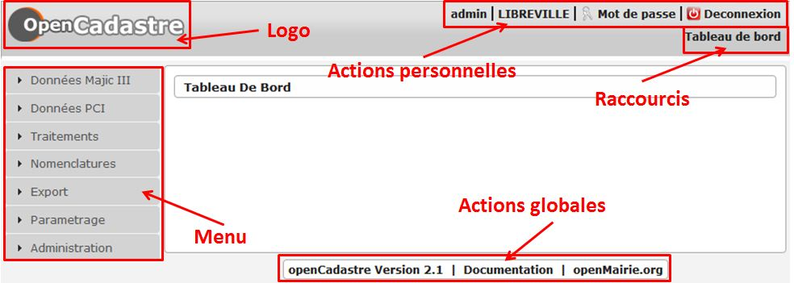

.. note::

    Les actions et affichages de l'application diffèrent en fonction du profil
    de l'utilisateur. Il se peut donc que dans les paragraphes qui suivent
    des actions soient décrites et n'apparaissent pas sur votre interface
    ou inversement que des actions ne soient pas décrites mais apparaissent sur
    votre interface.

Le logo
#######

C'est le logo de l'application, il vous permet en un seul clic de revenir
rapidement au tableau de bord.

Les actions personnelles
########################

Cet élément affiche plusieurs informations importantes.

La première information est l'identifiant de l'utilisateur actuellement
connecté ce qui permet de savoir à tout moment si nous sommes bien connectés
et avec quel utilisateur. Ensuite est noté le nom de la collectivité sur
laquelle nous sommes en train de travailler. En mode multi, une action est
disponible sur cette information pour permettre de changer de collectivité.
Ensuite la liste sur laquelle nous sommes en train de travailler, une action
est disponible sur cette information pour permettre de changer de liste.
Enfin l'action pour permettre de changer de mot de passe et pour se déconnecter
sont disponibles en permanence.

Les raccourcis
##############

Cet élément permet d'afficher des raccourcis vers des écrans auxquels nous
avons besoin d'accéder très souvent. Par exemple, ici nous avons un 
raccourci direct vers le tableau de bord.

Le menu
#######

Cet élément permet de classer les différents écrans de l'application en
rubriques. En cliquant sur l'entête de rubrique, nous accédons à la liste des
écrans auxquels nous avons accès dans cette rubrique.

Le nombre de rubriques disponibles dans le menu peut varier en fonction du
profil des utilisateurs. Un utilisateur ayant le profil Consultation n'aura
probablement pas accès aux six rubriques présentes sur cette capture. 

Les actions globales
####################

Cet élément permet d'afficher en permanence le numéro de version du logiciel.
Ensuite les différentes actions sont des liens vers le site officiel du
logiciel ou vers la documentation.

*************************
Ergonomie des formulaires
*************************

De manière générale, il y a une règle simple dans les applicatifs openMairie :
on accède d'abord à un listing d'éléments puis depuis ce listing on peut
ajouter un nouvel élément ou modifier un élément existant en accédant au
formulaire dédié à cet élément.

Les listings
############

Un listing est un tableau qui liste des éléments récapitulant des informations
permettant d'identifier un élément parmi les autres.

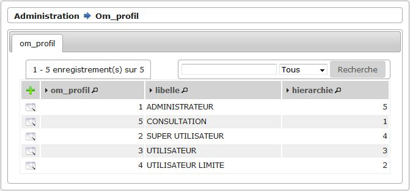

**Les actions**

*En haut à gauche*

* Ajouter : cette action représentée par un plus permet d'accéder au formulaire
  de création d'un élément.
  

* Autre : il peut y avoir d'autres actions positionnées ici qui représentent
  des actions que l'on peut faire sur un lot d'éléments par exemple.

*A gauche devant chaque élément*

* Visualiser : cette action permet d'accéder au formulaire de visualisation
  d'un élément.
  

* Autre : il peut y avoir d'autres actions positionnées ici qui permettent
  d'effectuer des actions rapides sans avoir besoin d'accéder au formulaire
  de l'élément en visualisation puis de cliquer sur une action parmi les
  actions contextuelles de l'élément.

*Sur l'élément*

* Visualiser : cette action permet d'accéder au formulaire de visualisation
  d'un élément.

Les formulaires
###############

Un formulaire dans cet applicatif peut soit être de visualisation soit d'action
(ajout, modification, suppression, ...). La différence est que le premier
contient un portlet d'actions contextuelles et que le deuxième contient un
bouton qui permet de valider le formulaire en question.

Voici l'exemple d'un formulaire en mode visualisation.

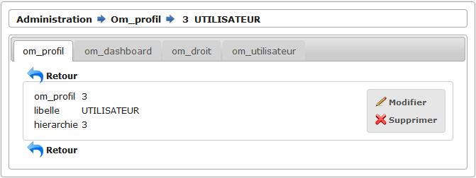
    

Voici l'exemple d'un formulaire en mode modification.

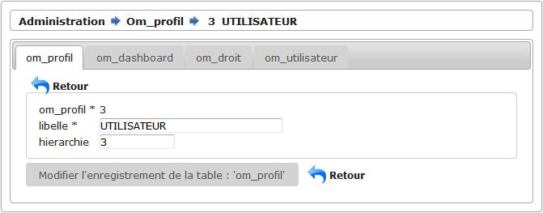
    
-----------------------

**Les actions**

-----------------------

Le portlet d'actions contextuelles se trouve sur le formulaire d'un élément
en mode visualisation. Il contient normalement toutes les actions possibles sur
cet élément par l'utilisateur. Il est situé en haut à droite du formulaire.

*Actions de formulaires*

* Modifier : cette action permet de transformer le mode visualisation de
  l'élément en mode modification. Une fois le formulaire de modification validé
  alors un bouton retour nous permet de revenir au formulaire en mode
  visualisation.

* Supprimer : cette action permet de transformer le mode visualisation de
  l'élément en mode suppression. Une fois le formulaire de suppression validé
  alors un bouton retour nous permet de revenir au listing des éléments.

*Autres actions*

* Le portlet d'acctions contextuelles peut contenir toutes les actions
  disponibles sur l'élément. Par exemple : il peut y avoir une action qui
  permet d'imprimer une édition PDF de l'élément, une autre action permettant
  de changer une valeur spécifique de l'élément comme "Marquer comme lu", ...

-----------------------

**Les onglets**

-----------------------

Sur le formulaire d'un élément, il peut apparaître plusieurs onglets qui
correspondent à des éléments liés à l'élément en cours. Un onglet présente un
listing de ces éléments liés avec des actions qui permettent également d'accéder
à des formulaires sur ces éléments liés.

Par exemple sur l'image suivante, on peut voir sur le "profil" un onglet
"tableau de bord" qui liste les tableaux de bord liés au profil utilisateur.

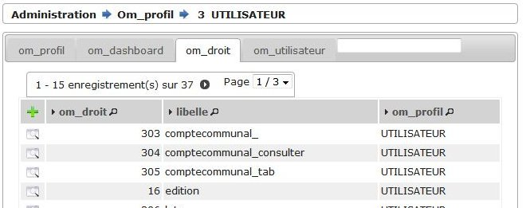

