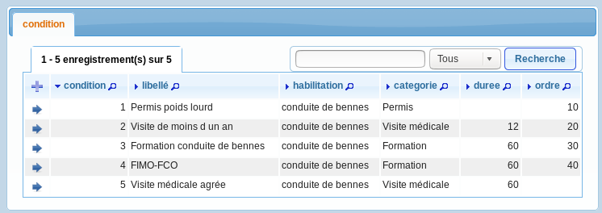
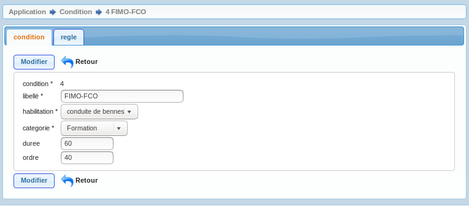

.. _condition:

Saisie condition
================

Il est possible de lister les conditions dans le menu parametrage metier -> option condition

Il est possible de modifier / supprimer les conditions dans le formulaire de saisie condition
en appuyant sur modifier ou supprimer

les champs suivants peuvent être mis a jour :

.. note::

	Le champ *'condition'* est un champ numerique entier obligatoire.

	Le champ *'libelle'* est un champ libelle obligatoire de 60 caractere(s) .

	Le champ *'habilitation'* est un champ numerique entier obligatoire.

	Le champ *'categorie'* est un champ numerique entier obligatoire.

	Le champ *'duree'* est un champ numerique entier non obligatoire.

	Le champ *'ordre'* est un champ numerique entier non obligatoire.

	Il y a une contrainte  de cle primaire  dont le nom est *'condition_pkey'*.

	Il y a une contrainte  de cle scondaire  dont le nom est *'condition_habilitation_fkey'*.

	Il y a une contrainte  de cle scondaire  dont le nom est *'condition_categorie_fkey'*.

Il est possible de saisir les champs suivants :

* Le libellé 
* L'habilitation
* La catégorie
* La durée en mois par défaut de la condition
* L'ordre dans lequel apparait les conditions dans le champ condition d'evéenement

Depuis le formulaire condition il est possible d'accéder au sous-formulaire *'regle'*

.. note::

	Les conditions peuvent être soumises à des règles pour le calcul de la durée
	qui se substituent à la durée par défaut
	(suivant l'age ou le type de formation)
	

