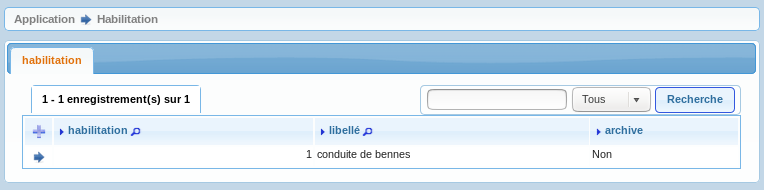
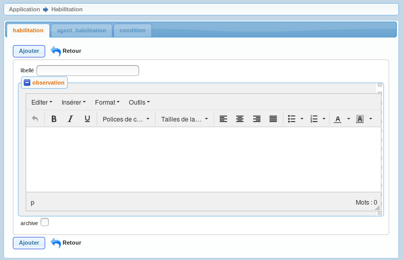

.. _habilitation:

Saisie habilitation
===================

Il est possible de lister les habilitations dans le menu  parametrage metier -> option habilitation

Il est possible de modifier / supprimer les habilitations dans le formulaire de saisie habilitation
en appuyant sur modifier ou supprimer

les champs suivants peuvent être mis a jour :

.. note::

	Le champ *'habilitation'* est un champ numerique entier obligatoire.

	Le champ *'libelle'* est un champ libelle obligatoire de 60 caractere(s) .

	Le champ *'observation'* est un champ texte non obligatoire.

	Le champ *'archive'* est un champ booleen obligatoire.

	Il y a une contrainte  de cle primaire  dont le nom est *'habilitation_pkey'*.

Il est possible de saisir les champs suivants :

* Le libellé 
* L'orservation
* L'archive, l'habilitation ne sera plus proposée dans *'agent_habilitation'*

Depuis le formulaire habilitation il est possible d'accéder au sous-formulaire *'agent_habilitation'* et *'condition'*

