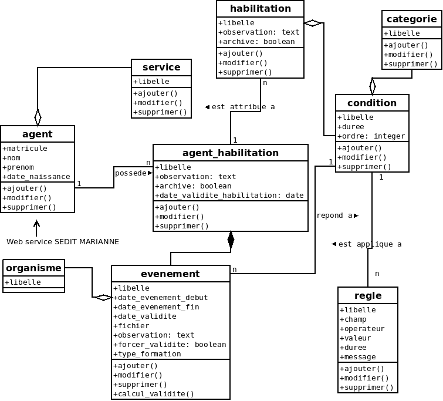

.. _diagramme_classe:

Diagramme de classe
===================

Le diagramme de classe propose  le modèle de données qui sera retenu dans 
l’application ainsi que les méthodes (ou traitement) associées à chaque 
classe (objet de base du logiciel).

A chaque création d’événement pour chaque agent-habilitation, il sera
mis à jour la date de validité de l’habilitation suivant la date de 
validité de l’événement  la plus rapprochée :

Exemple : pour un permis poids lourd valable 5 ans et une visite médicale
valable deux ans ; c’est la date la plus proche qui sera retenue 
pour la date de validité de l’habilitation.

Un web service sur la RH de Sedit Marianne récupère les informations
des agents.

