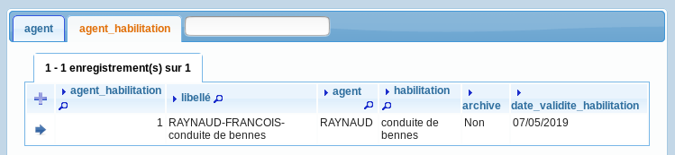
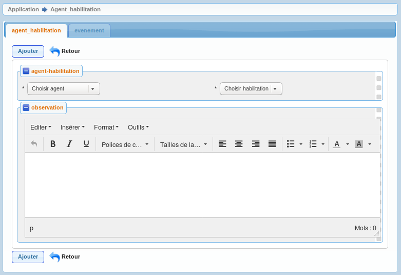

.. _agent_habilitation:

Saisie agent_habilitation
=========================

Il est possible de lister les agent_habilitations dans le menu  application -> option agent_habilitation

Il est possible de modifier / supprimer les agent_habilitations dans le formulaire de saisie agent_habilitation
en appuyant sur modifier ou supprimer

les champs suivants peuvent être mis a jour :

.. note::

	Le champ *'agent_habilitation'* est un champ numerique entier obligatoire.

	Le champ *'libelle'* est un champ libelle non obligatoire de 60 caractere(s) .

	Le champ *'agent'* est un champ numerique entier obligatoire.

	Le champ *'habilitation'* est un champ numerique entier obligatoire.

	Le champ *'observation'* est un champ texte non obligatoire.

	Le champ *'archive'* est un champ booleen obligatoire.

	Le champ *'date_validite_habilitation'* est un champ date non obligatoire.

	Il y a une contrainte  de cle primaire  dont le nom est *'agent_habilitation_pkey'*.

	Il y a une contrainte  de cle scondaire  dont le nom est *'agent_habilitation_agent_fkey'*.

	Il y a une contrainte  de cle scondaire  dont le nom est *'agent_habilitation_habilitation_fkey'*.

Il est possible de saisir les champs suivants :

* L'agent 
* L'habilitation
* L'observation
* L'archive
* La date de validité

Depuis le formulaire agent_habilitation il est possible d'accéder au sous-formulaire *'evenement'*

.. note::

	Le champ libelle se crée automatiquement sous la forme NOM-PRENOM-Libelle_de_l'habilitation
	
	Bien qu'il soit possible de forcer la date de validité, la méthode calcul_date_habilitation() de la classe /obj/evenement.php permet de la calculer automatiquement lorsque toutes les conditions de l'habilitation sont validées

